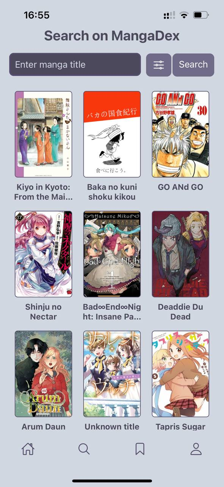

## Home page

## Search page
### Here you can search for manga by title or genre

  
  

## Manga page
### This page displays all the information about the manga, as well as the ability to open chapters and a button to add to collections

  
  

## Read page
### On this page you can read manga page by page, flipping through it with the ability to view comments from other users or leave comments yourself. You can make a bookmark at the top to track the reading process

  
  

